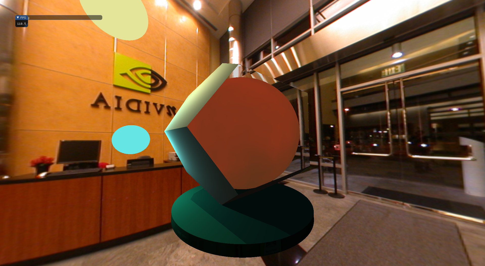

  Dodecahedron with a fireball inside 
## Main features:

- Control arcball camera with a mouse wheel
- Dodecahedron created from planes, no hard-coded coords.
- Perlin noise calculated in computer shader for fire simulation
- material modeling by combining transparency, reflection, refraction and color.
- ambient light reflected from active cubemap
- full inner reflection
- fireball burns in real time like gas movement on the surface of a star  

## Install depedencies:

`sudo apt-get install cmake`

`sudo apt-get install libglm-dev`

`sudo apt-get install libsdl2-dev`

# Run and build release:

`./build_script.sh RayTracing rel`

`./run_script.sh RayTracing rel`

or

`./build_script.sh`

`./run_script.sh`

# Run and build debug:

`./build_script.sh RayTracing dev`

`./run_script.sh RayTracing dev`

# Фccelerated Gif to show combustion:

